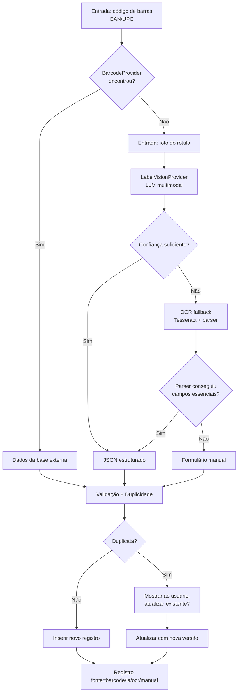

# Especificação Técnica — Módulo de Cadastro de Alimentos por Rótulo Nutricional

> **Projeto:** Cardápio Hospitalar (`/home/plena/cardapio_hospitalar2026/`)
> **Base:** SQLite `cardapio_hospitalar.db` | Flask + SQLAlchemy + Flask-Admin (`app2.py`, porta 5002) | Motor PuLP
> **Status:** Especificação v2 (sem armazenamento de imagens / sem rastreabilidade)
> **Uso:** Este documento é o contrato de implementação. Deve ser entregue como contexto ao agente de codificação no Zed (Claude Code / Codex / Gemini CLI via ACP), com o repositório aberto.

---

## 1. Objetivo

Cadastrar alimentos industrializados a partir do **código de barras** ou da **fotografia do rótulo nutricional**, reduzindo digitação manual. O sistema armazena **somente as informações efetivamente presentes no rótulo ou retornadas por uma base oficial** — não infere, não completa com TACO e não estima valores ausentes.

## 2. Fora de escopo (decisões do Bruno)

- ❌ **Não** armazenar fotos do código de barras, do rótulo ou da lista de ingredientes (sem auditoria/rastreabilidade).
- ❌ **Não** reprocessamento de imagens armazenadas.
- ❌ **Não** inferir micronutrientes (cálcio, ferro, vitaminas etc.) quando ausentes do rótulo.
- ❌ **Não** completar dados usando TACO ou outras bases nutricionais.
- ✅ A foto do rótulo é usada apenas **no momento do cadastro**, para extração, e é descartada em seguida.

## 3. Fluxo funcional



Regras de transição entre etapas:
1. **Código de barras é sempre a primeira opção.** Se encontrado em base externa, o cadastro vem de lá (fonte=`barcode`).
2. Se não encontrado → usuário é direcionado para a foto do rótulo.
3. LLM multimodal retorna **JSON estruturado** (seção 6) com indicador de confiança.
4. Se a confiança global for **< 0,80** (ou campos essenciais ausentes) → tenta **OCR (Tesseract)** como contingência.
5. Se o OCR também não produzir os campos essenciais → **cadastro manual**, com os campos já preenchidos pelo que foi possível extrair.

## 4. Arquitetura — Providers

Camada de abstração para trocar APIs sem alterar regras de negócio. Estrutura de arquivos sugerida dentro do projeto:

```
cardapio_hospitalar2026/
├── app2.py                     # (existente) — adicionar rotas e admin
├── rotulo/
│   ├── __init__.py
│   ├── config.py               # seleção de providers via variáveis de ambiente
│   ├── schemas.py              # JSON schema + validação (seção 6)
│   ├── providers/
│   │   ├── __init__.py
│   │   ├── base.py             # interfaces ABC (Barcode, Vision, OCR)
│   │   ├── barcode_openfoodfacts.py
│   │   └── vision_openai_compat.py   # Moonshot/Gemini/OpenAI/Claude (openai-compatible)
│   │   └── ocr_tesseract.py
│   ├── servico.py              # orquestrador: cadastrar_por_codigo / cadastrar_por_imagem
│   └── validacao.py            # regras de consistência + unidades
├── models_rotulo.py            # modelos SQLAlchemy (seção 5)
├── duplicidade.py              # fuzzy matching (rapidfuzz)
```

### 4.1 Interfaces (Python)

```python
# providers/base.py
from abc import ABC, abstractmethod

class BarcodeProvider(ABC):
    @abstractmethod
    def buscar(self, ean: str) -> dict | None:
        """Busca produto por EAN/UPC. Retorna dict no formato da seção 6 ou None."""

class LabelVisionProvider(ABC):
    @abstractmethod
    def extrair(self, imagem_bytes: bytes) -> dict:
        """Envia imagem ao LLM multimodal. Retorna dict conforme JSON schema (seção 6)."""

class OcrProvider(ABC):
    @abstractmethod
    def extrair_texto(self, imagem_bytes: bytes) -> str:
        """OCR puro. Retorna texto bruto para o parser."""
```

### 4.2 Implementações

| Provider | Descrição | Config |
|---|---|---|
| `OpenFoodFactsProvider` | Base mundial gratuita, sem chave. API v2: `GET https://world.openfoodfacts.org/api/v2/product/{ean}.json` | — |
| `VisionOpenAICompatProvider` | LLM multimodal via API OpenAI-compatível (base_url + model configuráveis). Serve para Moonshot/Kimi vision, Gemini (openai-compat), OpenAI, DeepSeek etc. | `ROTULO_VISION_BASE_URL`, `ROTULO_VISION_MODEL`, `ROTULO_VISION_API_KEY` |
| `TesseractOcrProvider` | OCR local (pytesseract + Pillow). Pós-processamento com regex por campo (ex: `(\d+(?:[.,]\d+)?)\s*(kcal|g|mg)`) | `tesseract_cmd` |

**Exemplo de configuração (`.env`):**

```bash
# Provider de código de barras
ROTULO_BARCODE_PROVIDER=openfoodfacts

# Provider de visão — exemplo Moonshot (Kimi) via OpenAI-compat
ROTULO_VISION_PROVIDER=openai_compat
ROTULO_VISION_BASE_URL=https://api.moonshot.cn/v1
ROTULO_VISION_MODEL=kimi-latest
ROTULO_VISION_API_KEY=sk-...
ROTULO_CONFIANCA_MINIMA=0.80

# Fallback OCR
ROTULO_OCR_PROVIDER=tesseract
```

> Nota: o `VisionOpenAICompatProvider` usa o parâmetro `response_format={"type": "json_object"}` e prompt com o schema (seção 6) embutido. O JSON retornado é validado contra o schema; se inválido, retry único e depois fallback OCR.

## 5. Modelo de dados

### 5.1 Decisão: tabela NOVA, separada de `ingredientes`

A tabela `ingredientes` existente é baseada em TACO (100g, 323 registros) e **não comporta** EAN, marca, fabricante, açúcares adicionados, gorduras trans, alérgenos nem lista de ingredientes. Mapear tudo nela poluiria o schema e violaria o princípio "só o que está no rótulo". Por isso, **tabela dedicada** `alimentos_industrializados` + tabela de **versionamento nutricional**.

### 5.2 DDL (aplicar manualmente no banco — Bruno aplica)

```sql
-- Tabela principal: alimentos industrializados cadastrados por rótulo
CREATE TABLE alimentos_industrializados (
    id INTEGER PRIMARY KEY AUTOINCREMENT,
    codigo_barras VARCHAR(14) UNIQUE,              -- EAN-13/UPC-A; NULL se não informado
    nome VARCHAR(200) NOT NULL,                    -- nome do produto (sem marca)
    marca VARCHAR(100),
    fabricante VARCHAR(150),
    peso_liquido DECIMAL(10,2),                    -- ex: 200
    unidade_peso VARCHAR(10),                      -- g | ml | kg | L (normalizado)
    porcao_qtd DECIMAL(8,2),                       -- ex: 30
    porcao_unidade VARCHAR(20),                    -- g | ml | fatia | unidade | xícara | ...
    energia_kcal DECIMAL(8,2),
    carboidratos_g DECIMAL(8,2),
    acucares_totais_g DECIMAL(8,2),
    acucares_adicionados_g DECIMAL(8,2),
    proteinas_g DECIMAL(8,2),
    gorduras_totais_g DECIMAL(8,2),
    gorduras_saturadas_g DECIMAL(8,2),
    gorduras_trans_g DECIMAL(8,2),
    fibras_g DECIMAL(8,2),
    sodio_mg DECIMAL(8,2),
    ingredientes_lista TEXT,                       -- texto da lista de ingredientes
    alergenos TEXT,                                -- JSON array de strings, ex: '["gluten","leite"]'
    fonte VARCHAR(10) NOT NULL DEFAULT 'manual'    -- barcode | ia | ocr | manual
        CHECK (fonte IN ('barcode','ia','ocr','manual')),
    versao INTEGER NOT NULL DEFAULT 1,
    criado_em DATETIME DEFAULT CURRENT_TIMESTAMP,
    editado_em DATETIME DEFAULT CURRENT_TIMESTAMP,
    desativado BOOLEAN DEFAULT 0
);

-- Histórico de versões nutricionais (fabricante alterou composição / correção)
CREATE TABLE alimento_versoes (
    id INTEGER PRIMARY KEY AUTOINCREMENT,
    alimento_id INTEGER NOT NULL REFERENCES alimentos_industrializados(id) ON DELETE CASCADE,
    versao INTEGER NOT NULL,
    dados_json TEXT NOT NULL,                      -- snapshot completo dos campos do rótulo
    motivo VARCHAR(30),                            -- fabricante_alterou | correcao | importacao
    criado_em DATETIME DEFAULT CURRENT_TIMESTAMP
);

-- Índices
CREATE INDEX idx_alimentos_nome ON alimentos_industrializados(nome);
CREATE INDEX idx_alimentos_marca ON alimentos_industrializados(marca);
CREATE INDEX idx_versoes_alimento ON alimento_versoes(alimento_id);
```

**Regras de armazenamento:**
- Valores sempre **como constam no rótulo** (base = porção declarada), com `porcao_qtd`/`porcao_unidade` guardando a base.
- Campo ausente no rótulo → **NULL** (nunca 0, nunca estimado).
- Quando o fabricante altera a composição: cria **nova versão** em `alimento_versoes` (snapshot do estado anterior) e atualiza a linha principal, incrementando `versao`.
- Unidades normalizadas: massa `mg|g|kg`, volume `ml|L`, energia `kcal`, porção livre (`fatia`, `unidade`, `xícara`...).

### 5.3 View de conversão para base 100g (para o motor PuLP)

```sql
CREATE VIEW vw_alimentos_industrializados_100g AS
SELECT
    id, nome, marca,
    CASE WHEN porcao_unidade IN ('g','ml') AND porcao_qtd > 0
         THEN ROUND(energia_kcal * 100.0 / porcao_qtd, 2) END AS energia_kcal_100g,
    CASE WHEN porcao_unidade IN ('g','ml') AND porcao_qtd > 0
         THEN ROUND(carboidratos_g * 100.0 / porcao_qtd, 2) END AS carboidratos_g_100g,
    CASE WHEN porcao_unidade IN ('g','ml') AND porcao_qtd > 0
         THEN ROUND(acucares_totais_g * 100.0 / porcao_qtd, 2) END AS acucares_totais_g_100g,
    CASE WHEN porcao_unidade IN ('g','ml') AND porcao_qtd > 0
         THEN ROUND(acucares_adicionados_g * 100.0 / porcao_qtd, 2) END AS acucares_adicionados_g_100g,
    CASE WHEN porcao_unidade IN ('g','ml') AND porcao_qtd > 0
         THEN ROUND(proteinas_g * 100.0 / porcao_qtd, 2) END AS proteinas_g_100g,
    CASE WHEN porcao_unidade IN ('g','ml') AND porcao_qtd > 0
         THEN ROUND(gorduras_totais_g * 100.0 / porcao_qtd, 2) END AS gorduras_totais_g_100g,
    CASE WHEN porcao_unidade IN ('g','ml') AND porcao_qtd > 0
         THEN ROUND(gorduras_saturadas_g * 100.0 / porcao_qtd, 2) END AS gorduras_saturadas_g_100g,
    CASE WHEN porcao_unidade IN ('g','ml') AND porcao_qtd > 0
         THEN ROUND(gorduras_trans_g * 100.0 / porcao_qtd, 2) END AS gorduras_trans_g_100g,
    CASE WHEN porcao_unidade IN ('g','ml') AND porcao_qtd > 0
         THEN ROUND(fibras_g * 100.0 / porcao_qtd, 2) END AS fibras_g_100g,
    CASE WHEN porcao_unidade IN ('g','ml') AND porcao_qtd > 0
         THEN ROUND(sodio_mg * 100.0 / porcao_qtd, 2) END AS sodio_mg_100g
FROM alimentos_industrializados
WHERE desativado = 0;
```

> **Regra de conversão:** só converte quando `porcao_unidade` é massa/volume (`g`, `ml`). Porções como "1 fatia" ou "1 unidade" **não são convertidas** (ficam NULL) — converter exigiria inferir o peso da fatia, o que viola o princípio do módulo.

## 6. JSON Schema — resposta da IA e da base externa

Formato único para: resposta do LLM, resposta do OpenFoodFacts (mapeada) e resultado do parser OCR. Campos de valor seguem o padrão `{valor, unidade, presente}`.

```json
{
  "codigo_barras": "7891234567890",
  "nome": "Biscoito integral de aveia e mel",
  "marca": "Marca Exemplo",
  "fabricante": "Indústria Exemplo S.A.",
  "peso_liquido": { "valor": 200, "unidade": "g" },
  "porcao": { "valor": 30, "unidade": "g" },
  "nutrientes": {
    "energia_kcal":          { "valor": 120, "unidade": "kcal", "presente": true },
    "carboidratos_g":        { "valor": 20.0, "unidade": "g",   "presente": true },
    "acucares_totais_g":     { "valor": 8.0,  "unidade": "g",   "presente": true },
    "acucares_adicionados_g":{ "valor": 6.0,  "unidade": "g",   "presente": true },
    "proteinas_g":           { "valor": 4.0,  "unidade": "g",   "presente": true },
    "gorduras_totais_g":     { "valor": 3.0,  "unidade": "g",   "presente": true },
    "gorduras_saturadas_g":  { "valor": 1.0,  "unidade": "g",   "presente": true },
    "gorduras_trans_g":      { "valor": null, "unidade": "g",   "presente": false },
    "fibras_g":              { "valor": 2.5,  "unidade": "g",   "presente": true },
    "sodio_mg":              { "valor": 180,  "unidade": "mg",  "presente": true }
  },
  "ingredientes_lista": "Farinha de trigo integral, aveia, mel, ...",
  "alergenos": ["gluten", "aveia"],
  "confianca_global": 0.87,
  "campos_baixa_confianca": ["acucares_adicionados_g"]
}
```

**Regras do schema:**
- `presente: false` → o campo não consta no rótulo → grava **NULL**.
- `valor: null` + `presente: true` → o modelo não conseguiu ler → conta como campo de baixa confiança.
- `campos_baixa_confianca` alimenta a interface: campos listados ficam destacados para revisão manual antes de salvar.
- Valores numéricos sempre `float`/`null`; unidades sempre string normalizada (seção 5.2).

## 7. Validação e consistência (`validacao.py`)

Antes da gravação, o serviço valida:

1. **Tipos:** todos os `valor` numéricos são `float` ou `null`; `codigo_barras` é string de 8–14 dígitos (vazio → NULL).
2. **Unidades:** permitidas para massa/volume/energia (seção 5.2); porção pode ser unidade livre mas `porcao_qtd` deve ser > 0 quando numérica.
3. **Não negatividade:** nenhum valor nutricional pode ser negativo.
4. **Consistência entre campos (apenas aviso, nunca correção):**
   - `acucares_adicionados_g ≤ acucares_totais_g` (quando ambos presentes)
   - `gorduras_saturadas_g + gorduras_trans_g ≤ gorduras_totais_g` (quando presentes)
   - `energia_kcal` plausível: `| energia − (4·proteina + 4·carboidrato + 9·gordura) | ≤ 30%` (arredondamentos de rótulo) — gera aviso, não bloqueia.
5. **Plausibilidade básica:** energia < 2000 kcal/100g e porção > 0 — fora disso bloqueia com mensagem clara (provável erro de leitura).

Campos que passaram com aviso são salvos normalmente; avisos vão para `observacoes`/log do cadastro.

## 8. Controle de duplicidade (`duplicidade.py`)

Executado **antes** de inserir, e **novamente no momento da confirmação** (evita corrida):

1. **Por EAN:** busca exata em `alimentos_industrializados.codigo_barras`.
   - Encontrou → **não cria novo**. Oferece: atualizar dados (nova versão) ou cancelar.
2. **Sem EAN (fuzzy):** compara com registros existentes usando `rapidfuzz`:
   - Similaridade `token_set_ratio` entre nomes ≥ **88** E mesma marca (case-insensitive, ou sem marca nos dois) → candidata a duplicata.
   - Se também houver `peso_liquido`, exige diferença ≤ 10% (ou ambos NULL).
3. Resultado: lista de duplicatas com `{id, nome, marca, peso, similaridade}` para o usuário decidir: **atualizar existente** (gera versão nova) ou **criar novo**.

## 9. Integração com a otimização (motor PuLP)

Requisito do domínio: o otimizador usa **apenas nutrientes efetivamente disponíveis** para cada alimento.

**Estratégia adotada (exclusão automática com relatório):**

1. O motor carrega os alimentos industrializados via `vw_alimentos_industrializados_100g` (base 100g, campos NULL quando não convertíveis).
2. Para cada restrição ativa do problema que exige nutriente `X`:
   - Alimentos com `X = NULL` são **excluídos do conjunto de variáveis** daquele problema.
3. O resultado da otimização inclui um relatório: `alimentos_excluidos = [{id, nome, nutriente_faltante}]` para o nutricionista entender por quê.
4. Não há preenchimento de default (zero ou estimativa) — exclusão é a regra.

> **Nota de implementação:** o motor atual (`motor_otimizacao2.py` / `cardapio_por_refeicao.py`) consome a tabela `ingredientes`. A integração mínima viável: um script/consulta que unifica `ingredientes` (TACO) + `vw_alimentos_industrializados_100g` no dicionário de entrada do PuLP, aplicando o filtro da regra 2. A validação da consistência dessa união (colunas equivalentes) fica como tarefa do Zed, documentada no relatório.

## 10. Integração com o app Flask existente

### 10.1 Modelos SQLAlchemy (`models_rotulo.py`)

```python
class AlimentoIndustrializado(Base):
    __tablename__ = "alimentos_industrializados"
    id = Column(Integer, primary_key=True)
    codigo_barras = Column(String(14), unique=True, nullable=True)
    nome = Column(String(200), nullable=False)
    marca = Column(String(100))
    fabricante = Column(String(150))
    peso_liquido = Column(Numeric(10,2))
    unidade_peso = Column(String(10))
    porcao_qtd = Column(Numeric(8,2))
    porcao_unidade = Column(String(20))
    energia_kcal = Column(Numeric(8,2))
    carboidratos_g = Column(Numeric(8,2))
    acucares_totais_g = Column(Numeric(8,2))
    acucares_adicionados_g = Column(Numeric(8,2))
    proteinas_g = Column(Numeric(8,2))
    gorduras_totais_g = Column(Numeric(8,2))
    gorduras_saturadas_g = Column(Numeric(8,2))
    gorduras_trans_g = Column(Numeric(8,2))
    fibras_g = Column(Numeric(8,2))
    sodio_mg = Column(Numeric(8,2))
    ingredientes_lista = Column(Text)
    alergenos = Column(Text)          # JSON string
    fonte = Column(String(10), default="manual")
    versao = Column(Integer, default=1)
    criado_em = Column(DateTime, default=func.now())
    editado_em = Column(DateTime, default=func.now(), onupdate=func.now())
    desativado = Column(Boolean, default=False)

class AlimentoVersao(Base):
    __tablename__ = "alimento_versoes"
    id = Column(Integer, primary_key=True)
    alimento_id = Column(Integer, ForeignKey("alimentos_industrializados.id", ondelete="CASCADE"))
    versao = Column(Integer)
    dados_json = Column(Text)         # snapshot
    motivo = Column(String(30))
    criado_em = Column(DateTime, default=func.now())
```

### 10.2 Rotas de API (adicionar no `app2.py`)

| Método | Rota | Função |
|---|---|---|
| `GET` | `/api/alimentos/consulta-ean?ean=...` | Busca na base externa; retorna dados + duplicatas locais |
| `POST` | `/api/alimentos/extrair-rotulo` | Upload de imagem (multipart `imagem`) → JSON extraído + duplicatas + avisos |
| `POST` | `/api/alimentos` | Confirma cadastro (payload: dados + `acao`: `criar`\|`atualizar` + `alimento_id` se atualizar) |
| `GET` | `/api/alimentos/busca?q=...` | Busca local (para tela de duplicidade/revisão) |

**Resposta padrão de extração (`extrair-rotulo`):**

```json
{
  "status": "ia" | "ocr" | "falhou",
  "dados": { "...schema seção 6..." },
  "duplicatas": [ { "id": 12, "nome": "...", "marca": "...", "similaridade": 0.94 } ],
  "avisos": [ "Açúcares adicionados > açúcares totais (verificar leitura)" ],
  "campos_revisao": ["acucares_adicionados_g"]
}
```

- `status: ia` → confiança ≥ limiar e schema válido.
- `status: ocr` → LLM falhou/baixa confiança, parser OCR produziu campos essenciais (nome + energia OU carboidratos).
- `status: falhou` → nem OCR; UI abre formulário manual pré-preenchido.

### 10.3 Interface

- **Página web** (rota `/rotulo` no Flask): formulário com campo EAN + input de arquivo de imagem + botão "Extrair". Após extração, mostra formulário de revisão com os campos extraídos, duplicatas detectadas (com opção "Atualizar existente") e avisos.
- **Flask-Admin:** adicionar ModelView de `AlimentoIndustrializado` (read/write) e `AlimentoVersao` (read-only), junto aos demais.

## 11. Dependências

```bash
pip install requests pytesseract Pillow rapidfuzz
# Opcional para pré-processamento de imagem no OCR:
pip install opencv-python-headless
# Sistema: tesseract-ocr instalado (apt install tesseract-ocr tesseract-ocr-por)
```

Nenhuma dependência nova para o LLM (HTTP puro via `requests`/`openai` compat).

## 12. Critérios de aceite / testes manuais

1. **EAN encontrado:** digitar EAN de produto conhecido → dados carregados da base → cadastro com `fonte=barcode`, sem digitação.
2. **EAN não encontrado:** direciona para upload de foto.
3. **Foto legível:** extração via IA → revisão → salvar com `fonte=ia`. Campos ausentes do rótulo ficam NULL.
4. **Foto difícil/borrada:** cai para OCR → campos essenciais preenchidos → `fonte=ocr` → revisão manual.
5. **Foto ilegível:** formulário manual pré-preenchido com o que sobrou.
6. **Duplicata por EAN:** tentar cadastrar EAN já existente → oferece atualizar (cria versão), não duplica.
7. **Duplicata fuzzy:** cadastrar "Biscoito Integral Aveia Mel 200g" com "Biscoito integral de aveia e mel" já existente → sugere duplicata com similaridade ≥ 88.
8. **Consistência:** rótulo com açúcares adicionados > totais → aviso exibido, gravação permitida.
9. **Versionamento:** atualizar composição de alimento existente → `alimento_versoes` ganha linha com snapshot anterior, `versao` incrementa.
10. **Otimização:** dieta com restrição de sódio, alimento industrializado sem sódio (NULL) → excluído do problema e listado no relatório.

## 13. Roteiro de implementação sugerido (para o agente no Zed)

Ordem sugerida, cada passo testável isoladamente:

1. **DDL + modelos:** aplicar DDL (Bruno aplica manualmente) e criar `models_rotulo.py` + registro no Flask-Admin.
2. **Providers base:** `providers/base.py` + `OpenFoodFactsProvider` + `VisionOpenAICompatProvider` + `TesseractOcrProvider` (com parser regex).
3. **Schema/validação:** `schemas.py` (validação do JSON contra a seção 6) + `validacao.py` (seção 7).
4. **Serviço orquestrador:** `servico.py` implementando o fluxo da seção 3 e os status da seção 10.2.
5. **Duplicidade:** `duplicidade.py` (EAN exato + fuzzy rapidfuzz).
6. **Rotas API + página `/rotulo`:** integrar no `app2.py`.
7. **Integração PuLP:** unificar `ingredientes` + view 100g no dicionário de entrada, com exclusão por nutriente faltante e relatório.
8. **Testes manuais:** executar os 10 critérios da seção 12.

---

## 14. Prompt inicial sugerido para o Zed

> Implemente o módulo de cadastro de alimentos por rótulo nutricional no projeto deste diretório, seguindo fielmente o documento `especificacao_modulo_rotulo.md`. Restrições importantes: (1) não armazenar imagens em lugar nenhum — a foto é usada só para extração e descartada; (2) nunca inferir/completar nutrientes ausentes — campo ausente = NULL; (3) os valores nutricionais são armazenados como constam no rótulo (base = porção), com view de conversão para 100g; (4) o cadastro manual no banco é feito pelo Bruno — o código não deve executar CREATE TABLE/ALTER; apenas modelos SQLAlchemy alinhados ao DDL do documento; (5) siga a ordem do roteiro da seção 13 e valide cada passo com os critérios da seção 12.
